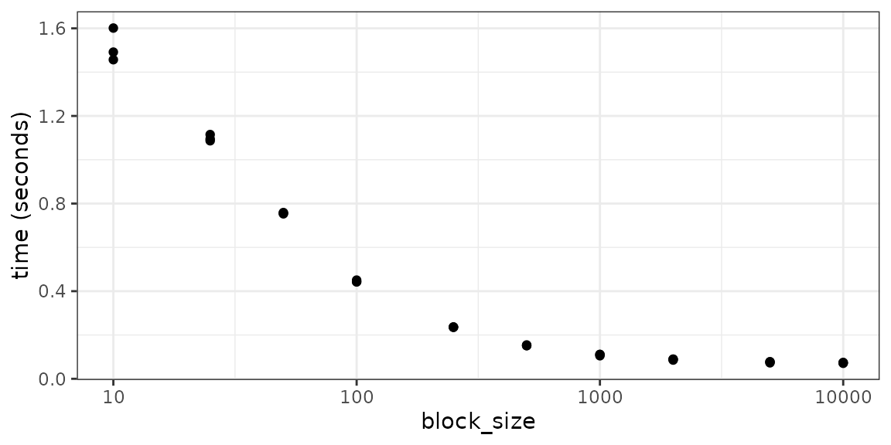

# \*\*rhdf5\*\* Practical Tips

Abstract

Provides discussion and practical examples for effectively using *rhdf5*
and the HDF5 file format.

## Introduction

There are scenarios where the most intuitive approach to working with
*rhdf5* or HDF5 will not be the most efficient. This may be due to
unfamiliar bottlenecks when working with data on-disk rather than in
memory, or idiosyncrasies in either the HDF5 library itself or the
*rhdf5* package. This vignette is intended to present a collection of
hints for circumventing some common pitfalls.

## Reading subsets of data

One of the cool features about the HDF5 file format is the ability to
read subsets of the data without (necessarily) having to read the entire
file, keeping both the memory usage and execution times of these
operations to a minimum. However this is not always as performant as one
might hope.

To demonstrate we’ll create some example data. This takes the form of a
matrix with 100 rows and 20,000 columns, where the content of each
column is the index of the column i.e. column 10 contains the value 10
repeated, column 20 contains 20 repeated etc. This is just so we can
easily check we’ve extracted the correct columns. We then write this
matrix to an HDF5 file, calling the dataset ‘counts’. [^1]

``` r

m1 <- matrix(rep(1:20000, each = 100), ncol = 20000, byrow = FALSE)
ex_file <- tempfile(fileext = ".h5")
h5write(m1, file = ex_file, name = "counts", level = 6)
```

    ## You created a large dataset with compression and chunking.
    ## The chunk size is equal to the dataset dimensions.
    ## If you want to read subsets of the dataset, you should test smaller chunk sizes to improve read times.

### Using the `index` argument

Now we’ll use the `index` argument to selectively extract the first
10,000 columns and time how long this takes.

``` r

system.time(
  res1 <- h5read(
    file = ex_file, name = "counts",
    index = list(NULL, 1:10000)
  )
)
```

    ##    user  system elapsed 
    ##   0.021   0.005   0.026

Next, instead of selecting 10,000 consecutive columns we’ll ask for
every other column. This should still return the same amount of data and
since our dataset is not chunked involves reading the same volume from
disk.

``` r

index <- list(NULL, seq(from = 1, to = 20000, by = 2))
system.time(
  res2 <- h5read(
    file = ex_file, name = "counts",
    index = index
  )
)
```

    ##    user  system elapsed 
    ##   0.058   0.003   0.060

We can see this is marginally slower, because there’s a small overhead
in selecting this disjoint set of columns, but it’s only marginal and
using the `index` argument looks sufficient.

### Using hyperslab selections

If you’re new to R, but have experience with HDF5 you might be more
familiar with using HDF5’s hyperslab selection method^\[The parameters
for defining hyperslab selection `start`, `stride`, `block`, & `count`
are not particularly intuitive if you are used to R’s index selection
methods. More examples discussing how to specify them can be found at
[www.hdfgroup.org](https://portal.hdfgroup.org/display/HDF5/Reading+From+or+Writing+To+a+Subset+of+a+Dataset).
The following code defines the parameters to select every other column,
the same as in our previous example.

``` r

start <- c(1, 1)
stride <- c(1, 2)
block <- c(100, 1)
count <- c(1, 10000)
system.time(
  res3 <- h5read(
    file = ex_file, name = "counts", start = start,
    stride = stride, block = block, count = count
  )
)
```

    ##    user  system elapsed 
    ##   0.053   0.003   0.056

``` r

identical(res2, res3)
```

    ## [1] TRUE

This runs in a similar time to when we used the `index` argument in the
example above, and the call to
[`identical()`](https://rdrr.io/r/base/identical.html) confirms we’re
returning the same data. In fact, under the hood, *rhdf5* converts the
`index` argument into `start`, `stride`, `block`, & `count` before
accessing the file, which is why the performance is so similar.

If there is a easily described pattern to the regions you want to access
e.g. a single block or a regular spacing, then either of these
approaches is effective.

### Irregular selections

However, things get a little more tricky if you want an irregular
selection of data, which is actually a pretty common operation. For
example, imagine wanting to select a random set of columns from our
data. If there isn’t a regular pattern to the columns you want to
select, what are the options? Perhaps the most obvious thing we can try
is to skip the use of either `index` or the hyperslab parameters and use
10,000 separate read operations instead. Below we choose a random
selection of columns[^2] and then apply the function `f1()` to each in
turn.

``` r

columns <- sample(x = seq_len(20000), size = 1000, replace = FALSE) %>%
  sort()
f1 <- function(cols, name) {
  h5read(
    file = ex_file, name = name,
    index = list(NULL, cols)
  )
}
```

``` r

system.time(res4 <- vapply(
  X = columns, FUN = f1,
  FUN.VALUE = integer(length = 100),
  name = "counts"
))
```

    ##    user  system elapsed 
    ##  16.976   0.051  17.031

This is clearly a terrible idea, it takes ages! For reference, using the
`index` argument with this set of columns takes 0.066 seconds. This poor
performance is driven by two things:

1.  Our dataset was created as a single chunk. This means for each
    access the entire dataset is read from disk, which we end up doing
    thousands of times.
2.  *rhdf5* does a lot of validation on the objects that are passed
    around internally. Within a call to
    [`h5read()`](https://huber-group-embl.github.io/rhdf5/reference/h5_read.md)
    HDF5 identifiers are created for the file, dataset, file dataspace,
    and memory dataspace, each of which are checked for validity. This
    overhead is negligible when only one call to
    [`h5read()`](https://huber-group-embl.github.io/rhdf5/reference/h5_read.md)
    is made, but be comes significant when we make thousands of separate
    calls.

There’s not much more you can do if the dataset is not chunked
appropriately, and using the `index` argument is reasonable. However
storing data in this format defeats one of HDF5’s key utilities, namely
rapid random access. As such it’s probably fairly rare to encounter
datasets that aren’t chunked in a more meaningful manner. With this in
mind we’ll create a new dataset in our file, based on the same matrix
but this time split into 100 $`\times`$ 100 chunks.

``` r

h5createDataset(
  file = ex_file, dataset = "counts_chunked",
  dims = dim(m1), storage.mode = "integer",
  chunk = c(100, 100), level = 6
)
h5write(obj = m1, file = ex_file, name = "counts_chunked")
```

If we rerun the same code, but reading from the chunked datasets we get
an idea for how much time is wasted extracting the entire dataset over
and over.

``` r

system.time(res5 <- vapply(
  X = columns, FUN = f1,
  FUN.VALUE = integer(length = 100),
  name = "counts_chunked"
))
```

    ##    user  system elapsed 
    ##   1.739   0.038   1.777

This is still quite slow, and the remaining time is being spent on the
overheads associated with multiple calls to
[`h5read()`](https://huber-group-embl.github.io/rhdf5/reference/h5_read.md).
To reduce these the function `f2()`[^3] defined below splits the list of
columns we want to return into sets grouped by the parameter
`block_size`. In the default case this means any columns between 1 & 100
will be placed together, then any between 101 & 200, etc. We then
[`lapply()`](https://rdrr.io/r/base/lapply.html) our previous `f1()`
function over these groups. The effect here is to reduce the number of
calls to
[`h5read()`](https://huber-group-embl.github.io/rhdf5/reference/h5_read.md),
while keeping the number of hyperslab unions down by not having too many
columns in any one call.

``` r

f2 <- function(block_size = 100) {
  cols_grouped <- split(columns, (columns - 1) %/% block_size)
  do.call(cbind, lapply(cols_grouped, f1, name = "counts_chunked"))
}
system.time(f2())
```

    ##    user  system elapsed 
    ##   0.417   0.007   0.424

We can see this has a significant effect, although it’s still an order
of magnitude slower than when we were dealing with regularly spaced
subsets. The efficiency here will vary based on a number of factors
including the size of the dataset chunks and the sparsity of the column
index, and you varying the `block_size` argument will produce differing
performances. The plot below shows the timings achieved by providing a
selection of values to `block_size`. It suggests the optimal parameter
in this case is probably a block size of 10000, which took 0.07
seconds - noticeably faster than when passing all columns to the `index`
argument in a single call.



#### Using hyperslab selection tools

If we were stuck with the single-chunk dataset and want to minimise the
number of read operations, it’s necessary to create larger selections
than the single column approach used above. We could again consider
using the HDF5 hyperslab selection tools, and if it’s not easy to
discern an underlying pattern to the selection, perhaps the simplest way
of approaching this with the would be to create one selection for each
column. You could then use functions like
[`H5Scombine_hyperslab()`](https://huber-group-embl.github.io/rhdf5/reference/H5Scombine_hyperslab.md)
or
[`H5Scombine_select()`](https://huber-group-embl.github.io/rhdf5/reference/H5Scombine_select.md)
to iteratively join these selections until all columns were selected,
and then perform the read operation.

#### Slowdown when selecting unions of hyperslabs

Unfortunately, this approach doesn’t scale very well. This is because
creating unions of hyperslabs is currently very slow in HDF5 (see [Union
of non-consecutive hyperslabs is very
slow](https://forum.hdfgroup.org/t/union-of-non-consecutive-hyperslabs-is-very-slow/5062)
for another report of this behaviour), with the performance penalty
increasing exponentially relative to the number of unions. The plot
below shows the the exponential increase in time as the number of
hyberslab unions increases.


The time taken to join hyperslabs increases expontentially with the
number of join operations. These timings are taken with no reading
occuring, just the creation of a dataset selection.

### Summary

Efficiently extracting arbitrary subsets of a HDF5 dataset with *rhdf5*
is a balancing act between the number of hyperslab unions, the number of
calls to
[`h5read()`](https://huber-group-embl.github.io/rhdf5/reference/h5_read.md),
and the number of times a chunk is read. Many of the lessons learnt will
creating this document have been incorporated into the
[`h5read()`](https://huber-group-embl.github.io/rhdf5/reference/h5_read.md)
function. Internally, this function attempts to find the balance by
looking for patterns in the data selection requested, and minimises the
number of hyperslab unions and read operations required to extract the
requested data.

## Writing in parallel

Using *[rhdf5](https://bioconductor.org/packages/3.23/rhdf5)* it isn’t
possible to open an HDF5 file and write multiple datasets in parallel.
However we can try to mimic this behaviour by writing each dataset to
it’s own HDF5 file in parallel and then using the function
[`H5Ocopy()`](https://huber-group-embl.github.io/rhdf5/reference/H5Ocopy.md)
to efficiently populate a complete final file. We’ll test this approach
here.

### Example data

First lets create some example data to we written to our HDF5 files. The
code below creates a list of 10 matrices, filled with random values
between 0 and 1. We then name the entries in the list `dset_1` etc.

``` r

dsets <- lapply(1:10, FUN = \(i) {
  matrix(runif(10000000), ncol = 100)
})
names(dsets) <- paste0("dset_", 1:10)
```

### Serial writing of datasets

Now lets define a function that takes our list of datasets and writes
all of them to a single HDF5 file.

``` r

simple_writer <- function(file_name, dsets) {
  fid <- H5Fcreate(name = file_name)
  on.exit(H5Fclose(fid))

  for (i in seq_along(dsets)) {
    dset_name <- paste0("dset_", i)
    h5createDataset(
      file = fid, dataset = dset_name,
      dims = dim(dsets[[i]]), chunk = c(10000, 10)
    )
    h5writeDataset(dsets[[i]], h5loc = fid, name = dset_name)
  }
}
```

An example of calling this function would look like:
`simple_writer(file_name = "my_datasets.h5", dsets = dsets)`. This would
create the file `my_datasets.h5` and it will contain the 10 datasets we
created above, each named `dset_1` etc, which are the names we gave the
list elements.

### Parallel writing of datasets

Now lets created two functions to tests our split / gather approach to
creating the final file. The first of the functions below will create a
temporary file with a random name and write a single dataset to this
file. The second function expects to be given a table of temporary files
and the name of the dataset they contain. It will then use
[`H5Ocopy()`](https://huber-group-embl.github.io/rhdf5/reference/H5Ocopy.md)
to write each of these into a single output file.

``` r

## Write a single dataset to a temporary file
## Arguments:
## - dset_name: The name of the dataset to be created
## - dset: The dataset to be written
split_tmp_h5 <- function(dset_name, dset) {
  ## create a tempory HDF5 file for this dataset
  file_name <- tempfile(pattern = "par", fileext = ".h5")
  fid <- H5Fcreate(file_name)
  on.exit(H5Fclose(fid))

  ## create and write the dataset
  ## we use some predefined chunk sizes
  h5createDataset(
    file = fid, dataset = dset_name,
    dims = dim(dset), chunk = c(10000, 10)
  )
  h5writeDataset(dset, h5loc = fid, name = dset_name)

  return(c(file_name, dset_name))
}

## Gather scattered datasets into a final single file
## Arguments:
## - output_file: The path to the final HDF5 to be created
## - input: A data.frame with two columns containing the paths to the temp
## files and the name of the dataset inside that file
gather_tmp_h5 <- function(output_file, input) {
  ## create the output file
  fid <- H5Fcreate(name = output_file)
  on.exit(H5Fclose(fid))

  ## iterate over the temp files and copy the named dataset into our new file
  for (i in seq_len(nrow(input))) {
    fid2 <- H5Fopen(input$file[i])
    H5Ocopy(fid2, input$dset[i], h5loc_dest = fid, name_dest = input$dset[i])
    H5Fclose(fid2)
  }
}
```

Finally we need to create a wrapper function that brings our split and
gather functions together. Like the `simple_writer()` function we
created earlier, this takes the name of an output file and the list of
datasets to be written as input. We can also provide a
`BiocParallelParam` instance from
*[BiocParallel](https://bioconductor.org/packages/3.23/BiocParallel)* to
trial writing the temporary file in parallel. If the `BPPARAM` argument
isn’t provided then they will be written in serial.

``` r

split_and_gather <- function(output_file, input_dsets, BPPARAM = NULL) {
  if (is.null(BPPARAM)) {
    BPPARAM <- BiocParallel::SerialParam()
  }

  ## write each of the matrices to a separate file
  tmp <-
    bplapply(seq_along(input_dsets),
      FUN = function(i) {
        split_tmp_h5(
          dset_name = names(input_dsets)[i],
          dset = input_dsets[[i]]
        )
      },
      BPPARAM = BPPARAM
    )

  ## create a table of file and the dataset names
  input_table <- do.call(rbind, tmp) |>
    as.data.frame()
  names(input_table) <- c("file", "dset")

  ## copy all datasets from temp files in to final output
  gather_tmp_h5(output_file = output_file, input = input_table)

  ## remove the temporary files
  file.remove(input_table$file)
}
```

An example of calling this using two cores on your local machine is:

``` r

split_and_gather(tempfile(),
  input_dsets = dsets,
  BPPARAM = MulticoreParam(workers = 2)
)
```

Below we can see some timings comparing calling `simple_writer()` with
`split_and_gather()` using 1, 2, and 4 cores.

    ## # A tibble: 4 × 3
    ##   expression               min median
    ##   <bch:expr>             <dbl>  <dbl>
    ## 1 simple writer           26.4   26.4
    ## 2 split/gather - 1 core   26.6   27.7
    ## 3 split/gather - 2 cores  13.6   14.2
    ## 4 split/gather - 4 cores  10.6   10.8

We can see from our benchmark results that there is some performance
improvement to be achieved by using the parallel approach. Based on the
median times of out three iterations using two cores sees an speedup of
1.86 and 2.4 with 4 cores. This isn’t quite linear, presumably because
there are overheads involved both in using a two-step process and
initialising the parallel workers, but it is a noticeable improvement.

## Session info

    ## R version 4.6.0 (2026-04-24)
    ## Platform: x86_64-pc-linux-gnu
    ## Running under: Ubuntu 24.04.4 LTS
    ## 
    ## Matrix products: default
    ## BLAS:   /usr/lib/x86_64-linux-gnu/openblas-pthread/libblas.so.3 
    ## LAPACK: /usr/lib/x86_64-linux-gnu/openblas-pthread/libopenblasp-r0.3.26.so;  LAPACK version 3.12.0
    ## 
    ## locale:
    ##  [1] LC_CTYPE=C.UTF-8       LC_NUMERIC=C           LC_TIME=C.UTF-8       
    ##  [4] LC_COLLATE=C.UTF-8     LC_MONETARY=C.UTF-8    LC_MESSAGES=C.UTF-8   
    ##  [7] LC_PAPER=C.UTF-8       LC_NAME=C              LC_ADDRESS=C          
    ## [10] LC_TELEPHONE=C         LC_MEASUREMENT=C.UTF-8 LC_IDENTIFICATION=C   
    ## 
    ## time zone: UTC
    ## tzcode source: system (glibc)
    ## 
    ## attached base packages:
    ## [1] stats     graphics  grDevices utils     datasets  methods   base     
    ## 
    ## other attached packages:
    ## [1] BiocParallel_1.46.0 ggplot2_4.0.3       dplyr_1.2.1        
    ## [4] rhdf5_2.57.0        BiocStyle_2.40.0   
    ## 
    ## loaded via a namespace (and not attached):
    ##  [1] gtable_0.3.6        jsonlite_2.0.0      compiler_4.6.0     
    ##  [4] BiocManager_1.30.27 tidyselect_1.2.1    rhdf5filters_1.24.0
    ##  [7] parallel_4.6.0      jquerylib_0.1.4     systemfonts_1.3.2  
    ## [10] scales_1.4.0        textshaping_1.0.5   yaml_2.3.12        
    ## [13] fastmap_1.2.0       R6_2.6.1            labeling_0.4.3     
    ## [16] generics_0.1.4      knitr_1.51          tibble_3.3.1       
    ## [19] bookdown_0.46       desc_1.4.3          bslib_0.11.0       
    ## [22] pillar_1.11.1       RColorBrewer_1.1-3  rlang_1.2.0        
    ## [25] utf8_1.2.6          cachem_1.1.0        xfun_0.57          
    ## [28] S7_0.2.2            fs_2.1.0            sass_0.4.10        
    ## [31] cli_3.6.6           withr_3.0.2         pkgdown_2.2.0      
    ## [34] magrittr_2.0.5      Rhdf5lib_2.0.0      digest_0.6.39      
    ## [37] grid_4.6.0          lifecycle_1.0.5     vctrs_0.7.3        
    ## [40] bench_1.1.4         evaluate_1.0.5      glue_1.8.1         
    ## [43] farver_2.1.2        codetools_0.2-20    ragg_1.5.2         
    ## [46] rmarkdown_2.31      tools_4.6.0         pkgconfig_2.0.3    
    ## [49] htmltools_0.5.9

[^1]: You’ll probably see a warning here regarding chunking, something
    we’ll touch on later

[^2]: in the interested of time we actually select only 1,000 columns
    here

[^3]: This is not the greatest function ever, things like the file name
    are hardcoded out of sight, but it illustrates the technique.
