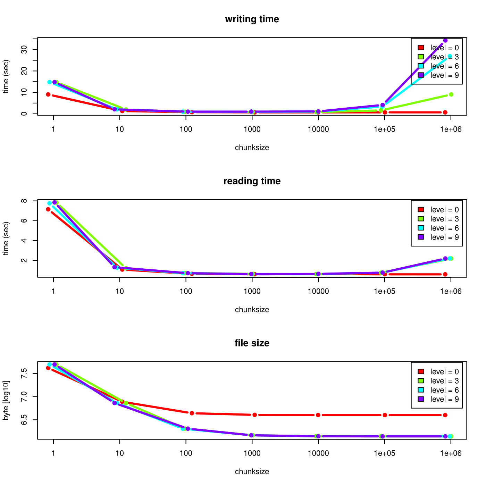

# rhdf5 - HDF5 interface for R

## Introduction

The package is an R interface for HDF5. On the one hand it implements
**R** interfaces to many of the low level functions from the C
interface. On the other hand it provides high level convenience
functions on **R** level to make a usage of HDF5 files more easy.

\#Installation of the HDF5 package To install the
*[rhdf5](https://bioconductor.org/packages/3.23/rhdf5)* package, you
need a current version (\>3.5.0) of **R** (www.r-project.org). After
installing **R** you can run the following commands from the **R**
command shell to install
*[rhdf5](https://bioconductor.org/packages/3.23/rhdf5)*.

``` r

install.packages("BiocManager")
BiocManager::install("rhdf5")
```

## High level R-HDF5 functions

### Creating an HDF5 file and group hierarchy

An empty HDF5 file is created by

``` r

library(rhdf5)
h5createFile("myhdf5file.h5")
```

The HDF5 file can contain a group hierarchy. We create a number of
groups and list the file content afterwards.

``` r

h5createGroup("myhdf5file.h5", "foo")
h5createGroup("myhdf5file.h5", "baa")
h5createGroup("myhdf5file.h5", "foo/foobaa")
h5ls("myhdf5file.h5")
```

    ##   group   name     otype dclass dim
    ## 0     /    baa H5I_GROUP           
    ## 1     /    foo H5I_GROUP           
    ## 2  /foo foobaa H5I_GROUP

### Writing and reading objects

Objects can be written to the HDF5 file. Attributes attached to an
object are written as well, if `write.attributes=TRUE` is given as
argument to
[`h5write()`](https://huber-group-embl.github.io/rhdf5/reference/h5_write.md).
Note that not all **R**-attributes can be written as HDF5 attributes.

``` r

A <- matrix(1:10, nrow = 5, ncol = 2)
h5write(A, "myhdf5file.h5", "foo/A")
B <- array(seq(0.1, 2.0, by = 0.1), dim = c(5, 2, 2))
attr(B, "scale") <- "liter"
h5write(B, "myhdf5file.h5", "foo/B")
C <- matrix(
  paste(LETTERS[1:10], LETTERS[11:20], collapse = ""),
  nrow = 2, ncol = 5
)
h5write(C, "myhdf5file.h5", "foo/foobaa/C")
df <- data.frame(1L:5L, seq(0, 1, length.out = 5),
  c("ab", "cde", "fghi", "a", "s"),
  stringsAsFactors = FALSE
)
h5write(df, "myhdf5file.h5", "df")
h5ls("myhdf5file.h5")
```

    ##         group   name       otype   dclass       dim
    ## 0           /    baa   H5I_GROUP                   
    ## 1           /     df H5I_DATASET COMPOUND         5
    ## 2           /    foo   H5I_GROUP                   
    ## 3        /foo      A H5I_DATASET  INTEGER     5 x 2
    ## 4        /foo      B H5I_DATASET    FLOAT 5 x 2 x 2
    ## 5        /foo foobaa   H5I_GROUP                   
    ## 6 /foo/foobaa      C H5I_DATASET   STRING     2 x 5

``` r

D <- h5read("myhdf5file.h5", "foo/A")
E <- h5read("myhdf5file.h5", "foo/B")
F <- h5read("myhdf5file.h5", "foo/foobaa/C")
G <- h5read("myhdf5file.h5", "df")
```

If a dataset with the given `name` does not yet exist, a dataset is
created in the HDF5 file and the object `obj` is written to the HDF5
file. If a dataset with the given `name` already exists and the datatype
and the dimensions are the same as for the object `obj`, the data in the
file is overwritten. If the dataset already exists and either the
datatype or the dimensions are different,
[`h5write()`](https://huber-group-embl.github.io/rhdf5/reference/h5_write.md)
fails.

### Writing and reading objects with file, group and dataset handles

File, group and dataset handles are a simpler way to read (and partially
to write) HDF5 files. A file is opened by
[`H5Fopen()`](https://huber-group-embl.github.io/rhdf5/reference/H5Fopen.md).

``` r

h5f <- H5Fopen("myhdf5file.h5")
h5f
```

    ## HDF5 FILE 
    ##         name /
    ##     filename 
    ## 
    ##   name       otype   dclass dim
    ## 0  baa H5I_GROUP               
    ## 1  df  H5I_DATASET COMPOUND   5
    ## 2  foo H5I_GROUP

The `$` and `&` operators can be used to access the next group level.
While the `$` operator reads the object from disk, the `&` operator
returns a group or dataset handle.

``` r

h5f$df
```

    ##   X1L.5L seq.0..1..length.out...5. c..ab....cde....fghi....a....s..
    ## 1      1                      0.00                               ab
    ## 2      2                      0.25                              cde
    ## 3      3                      0.50                             fghi
    ## 4      4                      0.75                                a
    ## 5      5                      1.00                                s

``` r

h5f & "df"
```

    ## HDF5 DATASET 
    ##         name /df
    ##     filename 
    ##         type H5T_COMPOUND
    ##         rank 1
    ##         size 5
    ##      maxsize 5

Both of the following code lines return the matrix `C`. Note however,
that the first version reads the whole tree `/foo` in memory and then
subsets to `/foobaa/C`, and the second version only reads the matrix
`C`. The first `$` in `h5f$foo$foobaa$C` reads the dataset, the other
`$` are accessors of a list. Remind that this can have severe
consequences for large datasets and datastructures.

``` r

h5f$foo$foobaa$C
```

    ##      [,1]                             [,2]                            
    ## [1,] "A KB LC MD NE OF PG QH RI SJ T" "A KB LC MD NE OF PG QH RI SJ T"
    ## [2,] "A KB LC MD NE OF PG QH RI SJ T" "A KB LC MD NE OF PG QH RI SJ T"
    ##      [,3]                             [,4]                            
    ## [1,] "A KB LC MD NE OF PG QH RI SJ T" "A KB LC MD NE OF PG QH RI SJ T"
    ## [2,] "A KB LC MD NE OF PG QH RI SJ T" "A KB LC MD NE OF PG QH RI SJ T"
    ##      [,5]                            
    ## [1,] "A KB LC MD NE OF PG QH RI SJ T"
    ## [2,] "A KB LC MD NE OF PG QH RI SJ T"

``` r

h5f$"/foo/foobaa/C"
```

    ##      [,1]                             [,2]                            
    ## [1,] "A KB LC MD NE OF PG QH RI SJ T" "A KB LC MD NE OF PG QH RI SJ T"
    ## [2,] "A KB LC MD NE OF PG QH RI SJ T" "A KB LC MD NE OF PG QH RI SJ T"
    ##      [,3]                             [,4]                            
    ## [1,] "A KB LC MD NE OF PG QH RI SJ T" "A KB LC MD NE OF PG QH RI SJ T"
    ## [2,] "A KB LC MD NE OF PG QH RI SJ T" "A KB LC MD NE OF PG QH RI SJ T"
    ##      [,5]                            
    ## [1,] "A KB LC MD NE OF PG QH RI SJ T"
    ## [2,] "A KB LC MD NE OF PG QH RI SJ T"

One can as well return a dataset handle for a matrix and then read the
matrix in chunks for out-of-memory computations. .

``` r

h5d <- h5f & "/foo/B"
h5d[]
```

    ## , , 1
    ## 
    ##      [,1] [,2]
    ## [1,]  0.1  0.6
    ## [2,]  0.2  0.7
    ## [3,]  0.3  0.8
    ## [4,]  0.4  0.9
    ## [5,]  0.5  1.0
    ## 
    ## , , 2
    ## 
    ##      [,1] [,2]
    ## [1,]  1.1  1.6
    ## [2,]  1.2  1.7
    ## [3,]  1.3  1.8
    ## [4,]  1.4  1.9
    ## [5,]  1.5  2.0

``` r

h5d[3, , ]
```

    ##      [,1] [,2]
    ## [1,]  0.3  1.3
    ## [2,]  0.8  1.8

The same works as well for writing to datasets.

``` r

h5d[3, , ] <- 1:4
H5Fflush(h5f)
```

Remind again that in the following code the first version does not
change the data on disk, but the second does.

``` r

h5f$foo$B <- 101:120
h5f$"/foo/B" <- 101:120
```

It is important to close all dataset, group, and file handles when not
used anymore

``` r

H5Dclose(h5d)
H5Fclose(h5f)
```

or close all open HDF5 handles in the environment by

``` r

h5closeAll()
```

The *[rhdf5](https://bioconductor.org/packages/3.23/rhdf5)* package
provides two ways of subsetting. One can specify the submatrix with the
**R**-style index lists or with the HDF5 style hyperslabs. Note, that
the two next examples below show two alternative ways for reading and
writing the exact same submatrices. Before writing subsetting or
hyperslabbing, the dataset with full dimensions has to be created in the
HDF5 file. This can be achieved by writing once an array with full
dimensions as in Section or by creating a dataset. Afterwards the
dataset can be written sequentially.

The chosen chunk size and compression level have a strong impact on the
reading and writing time as well as on the resulting file size. In an
example an integer vector of size 10e7 is written to an HDF5 file. The
file is written in subvectors of size 10’000. The definition of the
chunk size influences the reading as well as the writing time. If the
chunk size is much smaller or much larger than actually used, the
runtime performance decreases dramatically. Furthermore the file size is
larger for smaller chunk sizes, because of an overhead. The compression
can be much more efficient when the chunk size is very large. The
following figure illustrates the runtime and file size behaviour as a
function of the chunk size for a small toy dataset.



After the creation of the dataset, the data can be written sequentially
to the HDF5 file. Subsetting in **R**-style needs the specification of
the argument index to
[`h5read()`](https://huber-group-embl.github.io/rhdf5/reference/h5_read.md)
and
[`h5write()`](https://huber-group-embl.github.io/rhdf5/reference/h5_write.md).

``` r

h5createDataset("myhdf5file.h5", "foo/S", c(5, 8),
  storage.mode = "integer", chunk = c(5, 1), level = 7
)
h5write(matrix(1:5, nrow = 5, ncol = 1),
  file = "myhdf5file.h5",
  name = "foo/S", index = list(NULL, 1)
)
h5read("myhdf5file.h5", "foo/S")
```

    ##      [,1] [,2] [,3] [,4] [,5] [,6] [,7] [,8]
    ## [1,]    1    0    0    0    0    0    0    0
    ## [2,]    2    0    0    0    0    0    0    0
    ## [3,]    3    0    0    0    0    0    0    0
    ## [4,]    4    0    0    0    0    0    0    0
    ## [5,]    5    0    0    0    0    0    0    0

``` r

h5write(6:10,
  file = "myhdf5file.h5",
  name = "foo/S", index = list(1, 2:6)
)
h5read("myhdf5file.h5", "foo/S")
```

    ##      [,1] [,2] [,3] [,4] [,5] [,6] [,7] [,8]
    ## [1,]    1    6    7    8    9   10    0    0
    ## [2,]    2    0    0    0    0    0    0    0
    ## [3,]    3    0    0    0    0    0    0    0
    ## [4,]    4    0    0    0    0    0    0    0
    ## [5,]    5    0    0    0    0    0    0    0

``` r

h5write(matrix(11:40, nrow = 5, ncol = 6),
  file = "myhdf5file.h5",
  name = "foo/S", index = list(1:5, 3:8)
)
h5read("myhdf5file.h5", "foo/S")
```

    ##      [,1] [,2] [,3] [,4] [,5] [,6] [,7] [,8]
    ## [1,]    1    6   11   16   21   26   31   36
    ## [2,]    2    0   12   17   22   27   32   37
    ## [3,]    3    0   13   18   23   28   33   38
    ## [4,]    4    0   14   19   24   29   34   39
    ## [5,]    5    0   15   20   25   30   35   40

``` r

h5write(matrix(141:144, nrow = 2, ncol = 2),
  file = "myhdf5file.h5",
  name = "foo/S", index = list(3:4, 1:2)
)
h5read("myhdf5file.h5", "foo/S")
```

    ##      [,1] [,2] [,3] [,4] [,5] [,6] [,7] [,8]
    ## [1,]    1    6   11   16   21   26   31   36
    ## [2,]    2    0   12   17   22   27   32   37
    ## [3,]  141  143   13   18   23   28   33   38
    ## [4,]  142  144   14   19   24   29   34   39
    ## [5,]    5    0   15   20   25   30   35   40

``` r

h5write(matrix(151:154, nrow = 2, ncol = 2),
  file = "myhdf5file.h5",
  name = "foo/S", index = list(2:3, c(3, 6))
)
h5read("myhdf5file.h5", "foo/S")
```

    ##      [,1] [,2] [,3] [,4] [,5] [,6] [,7] [,8]
    ## [1,]    1    6   11   16   21   26   31   36
    ## [2,]    2    0  151   17   22  153   32   37
    ## [3,]  141  143  152   18   23  154   33   38
    ## [4,]  142  144   14   19   24   29   34   39
    ## [5,]    5    0   15   20   25   30   35   40

``` r

h5read("myhdf5file.h5", "foo/S", index = list(2:3, 2:3))
```

    ##      [,1] [,2]
    ## [1,]    0  151
    ## [2,]  143  152

``` r

h5read("myhdf5file.h5", "foo/S", index = list(2:3, c(2, 4)))
```

    ##      [,1] [,2]
    ## [1,]    0   17
    ## [2,]  143   18

``` r

h5read("myhdf5file.h5", "foo/S", index = list(2:3, c(1, 2, 4, 5)))
```

    ##      [,1] [,2] [,3] [,4]
    ## [1,]    2    0   17   22
    ## [2,]  141  143   18   23

The HDF5 hyperslabs are defined by some of the arguments `start`,
`stride`, `count`, and `block`. These arguments are not effective, if
the argument `index` is specified.

``` r

h5createDataset("myhdf5file.h5", "foo/H", c(5, 8),
  storage.mode = "integer",
  chunk = c(5, 1), level = 7
)
h5write(matrix(1:5, nrow = 5, ncol = 1),
  file = "myhdf5file.h5", name = "foo/H",
  start = c(1, 1)
)
h5read("myhdf5file.h5", "foo/H")
```

    ##      [,1] [,2] [,3] [,4] [,5] [,6] [,7] [,8]
    ## [1,]    1    0    0    0    0    0    0    0
    ## [2,]    2    0    0    0    0    0    0    0
    ## [3,]    3    0    0    0    0    0    0    0
    ## [4,]    4    0    0    0    0    0    0    0
    ## [5,]    5    0    0    0    0    0    0    0

``` r

h5write(6:10,
  file = "myhdf5file.h5", name = "foo/H",
  start = c(1, 2), count = c(1, 5)
)
h5read("myhdf5file.h5", "foo/H")
```

    ##      [,1] [,2] [,3] [,4] [,5] [,6] [,7] [,8]
    ## [1,]    1    6    7    8    9   10    0    0
    ## [2,]    2    0    0    0    0    0    0    0
    ## [3,]    3    0    0    0    0    0    0    0
    ## [4,]    4    0    0    0    0    0    0    0
    ## [5,]    5    0    0    0    0    0    0    0

``` r

h5write(matrix(11:40, nrow = 5, ncol = 6),
  file = "myhdf5file.h5", name = "foo/H",
  start = c(1, 3)
)
h5read("myhdf5file.h5", "foo/H")
```

    ##      [,1] [,2] [,3] [,4] [,5] [,6] [,7] [,8]
    ## [1,]    1    6   11   16   21   26   31   36
    ## [2,]    2    0   12   17   22   27   32   37
    ## [3,]    3    0   13   18   23   28   33   38
    ## [4,]    4    0   14   19   24   29   34   39
    ## [5,]    5    0   15   20   25   30   35   40

``` r

h5write(matrix(141:144, nrow = 2, ncol = 2),
  file = "myhdf5file.h5", name = "foo/H",
  start = c(3, 1)
)
h5read("myhdf5file.h5", "foo/H")
```

    ##      [,1] [,2] [,3] [,4] [,5] [,6] [,7] [,8]
    ## [1,]    1    6   11   16   21   26   31   36
    ## [2,]    2    0   12   17   22   27   32   37
    ## [3,]  141  143   13   18   23   28   33   38
    ## [4,]  142  144   14   19   24   29   34   39
    ## [5,]    5    0   15   20   25   30   35   40

``` r

h5write(matrix(151:154, nrow = 2, ncol = 2),
  file = "myhdf5file.h5", name = "foo/H",
  start = c(2, 3), stride = c(1, 3)
)
h5read("myhdf5file.h5", "foo/H")
```

    ##      [,1] [,2] [,3] [,4] [,5] [,6] [,7] [,8]
    ## [1,]    1    6   11   16   21   26   31   36
    ## [2,]    2    0  151   17   22  153   32   37
    ## [3,]  141  143  152   18   23  154   33   38
    ## [4,]  142  144   14   19   24   29   34   39
    ## [5,]    5    0   15   20   25   30   35   40

``` r

h5read("myhdf5file.h5", "foo/H",
  start = c(2, 2), count = c(2, 2)
)
```

    ##      [,1] [,2]
    ## [1,]    0  151
    ## [2,]  143  152

``` r

h5read("myhdf5file.h5", "foo/H",
  start = c(2, 2), stride = c(1, 2), count = c(2, 2)
)
```

    ##      [,1] [,2]
    ## [1,]    0   17
    ## [2,]  143   18

``` r

h5read("myhdf5file.h5", "foo/H",
  start = c(2, 1), stride = c(1, 3), count = c(2, 2), block = c(1, 2)
)
```

    ##      [,1] [,2] [,3] [,4]
    ## [1,]    2    0   17   22
    ## [2,]  141  143   18   23

### Saving multiple objects to an HDF5 file (h5save)

A number of objects can be written to the top level group of an HDF5
file with the function
[`h5save()`](https://huber-group-embl.github.io/rhdf5/reference/h5_save.md)
(as analogous to the base **R** function
[`save()`](https://rdrr.io/r/base/save.html)).

``` r

A <- 1:7
B <- 1:18
D <- seq(0, 1, by = 0.1)
h5save(A, B, D, file = "newfile2.h5")
h5dump("newfile2.h5")
```

    ## $A
    ## [1] 1 2 3 4 5 6 7
    ## 
    ## $B
    ##  [1]  1  2  3  4  5  6  7  8  9 10 11 12 13 14 15 16 17 18
    ## 
    ## $D
    ##  [1] 0.0 0.1 0.2 0.3 0.4 0.5 0.6 0.7 0.8 0.9 1.0

### List the content of an HDF5 file

The function
[`h5ls()`](https://huber-group-embl.github.io/rhdf5/reference/h5ls.md)
provides some ways of viewing the content of an HDF5 file.

``` r

h5ls("myhdf5file.h5")
```

    ##         group   name       otype   dclass       dim
    ## 0           /    baa   H5I_GROUP                   
    ## 1           /     df H5I_DATASET COMPOUND         5
    ## 2           /    foo   H5I_GROUP                   
    ## 3        /foo      A H5I_DATASET  INTEGER     5 x 2
    ## 4        /foo      B H5I_DATASET    FLOAT 5 x 2 x 2
    ## 5        /foo      H H5I_DATASET  INTEGER     5 x 8
    ## 6        /foo      S H5I_DATASET  INTEGER     5 x 8
    ## 7        /foo foobaa   H5I_GROUP                   
    ## 8 /foo/foobaa      C H5I_DATASET   STRING     2 x 5

``` r

h5ls("myhdf5file.h5", all = TRUE)
```

    ##         group   name         ltype cset       otype num_attrs   dclass
    ## 0           /    baa H5L_TYPE_HARD    0   H5I_GROUP         0         
    ## 1           /     df H5L_TYPE_HARD    0 H5I_DATASET         0 COMPOUND
    ## 2           /    foo H5L_TYPE_HARD    0   H5I_GROUP         0         
    ## 3        /foo      A H5L_TYPE_HARD    0 H5I_DATASET         1  INTEGER
    ## 4        /foo      B H5L_TYPE_HARD    0 H5I_DATASET         1    FLOAT
    ## 5        /foo      H H5L_TYPE_HARD    0 H5I_DATASET         1  INTEGER
    ## 6        /foo      S H5L_TYPE_HARD    0 H5I_DATASET         1  INTEGER
    ## 7        /foo foobaa H5L_TYPE_HARD    0   H5I_GROUP         0         
    ## 8 /foo/foobaa      C H5L_TYPE_HARD    0 H5I_DATASET         1   STRING
    ##            dtype  stype rank       dim    maxdim
    ## 0                          0                    
    ## 1   H5T_COMPOUND SIMPLE    1         5         5
    ## 2                          0                    
    ## 3  H5T_STD_I32LE SIMPLE    2     5 x 2     5 x 2
    ## 4 H5T_IEEE_F64LE SIMPLE    3 5 x 2 x 2 5 x 2 x 2
    ## 5  H5T_STD_I32LE SIMPLE    2     5 x 8     5 x 8
    ## 6  H5T_STD_I32LE SIMPLE    2     5 x 8     5 x 8
    ## 7                          0                    
    ## 8     H5T_STRING SIMPLE    2     2 x 5     2 x 5

``` r

h5ls("myhdf5file.h5", recursive = 2)
```

    ##   group   name       otype   dclass       dim
    ## 0     /    baa   H5I_GROUP                   
    ## 1     /     df H5I_DATASET COMPOUND         5
    ## 2     /    foo   H5I_GROUP                   
    ## 3  /foo      A H5I_DATASET  INTEGER     5 x 2
    ## 4  /foo      B H5I_DATASET    FLOAT 5 x 2 x 2
    ## 5  /foo      H H5I_DATASET  INTEGER     5 x 8
    ## 6  /foo      S H5I_DATASET  INTEGER     5 x 8
    ## 7  /foo foobaa   H5I_GROUP

### Dump the content of an HDF5 file

The function
[`h5dump()`](https://huber-group-embl.github.io/rhdf5/reference/h5_dump.md)
is similar to the function
[`h5ls()`](https://huber-group-embl.github.io/rhdf5/reference/h5ls.md).
If used with the argument `load=FALSE`, it produces the same result as
[`h5ls()`](https://huber-group-embl.github.io/rhdf5/reference/h5ls.md),
but with the group structure resolved as a hierarchy of lists. If the
default argument `load=TRUE` is used all datasets from the HDF5 file are
read.

``` r

h5dump("myhdf5file.h5", load = FALSE)
```

    ## $baa
    ## NULL
    ## 
    ## $df
    ##   group name       otype   dclass dim
    ## 1     /   df H5I_DATASET COMPOUND   5
    ## 
    ## $foo
    ## $foo$A
    ##   group name       otype  dclass   dim
    ## 1     /    A H5I_DATASET INTEGER 5 x 2
    ## 
    ## $foo$B
    ##   group name       otype dclass       dim
    ## 1     /    B H5I_DATASET  FLOAT 5 x 2 x 2
    ## 
    ## $foo$H
    ##   group name       otype  dclass   dim
    ## 1     /    H H5I_DATASET INTEGER 5 x 8
    ## 
    ## $foo$S
    ##   group name       otype  dclass   dim
    ## 1     /    S H5I_DATASET INTEGER 5 x 8
    ## 
    ## $foo$foobaa
    ## $foo$foobaa$C
    ##   group name       otype dclass   dim
    ## 1     /    C H5I_DATASET STRING 2 x 5

``` r

D <- h5dump("myhdf5file.h5")
```

### Reading HDF5 files with external software

The content of the HDF5 file can be checked with the command line tool
**h5dump** (available on linux-like systems with the HDF5 tools package
installed) or with the graphical user interface **HDFView**
(<http://www.hdfgroup.org/hdf-java-html/hdfview/>) available for all
major platforms.

``` r

system2("h5dump", "myhdf5file.h5")
```

*Please note, that arrays appear as transposed matrices when opening it
with a C-program (**h5dump** or **HDFView**). This is due to the fact
the fastest changing dimension on C is the last one, but on R it is the
first one (as in Fortran).*

### Removing content from an HDF5 file

As well as adding content to an HDF5 file, it is possible to remove
entries using the function
[`h5delete()`](https://huber-group-embl.github.io/rhdf5/reference/h5_delete.md).
To demonstrate it’s use, we’ll first list the contents of a file and
examine the size of the file in bytes.

``` r

h5ls("myhdf5file.h5", recursive = 2)
```

    ##   group   name       otype   dclass       dim
    ## 0     /    baa   H5I_GROUP                   
    ## 1     /     df H5I_DATASET COMPOUND         5
    ## 2     /    foo   H5I_GROUP                   
    ## 3  /foo      A H5I_DATASET  INTEGER     5 x 2
    ## 4  /foo      B H5I_DATASET    FLOAT 5 x 2 x 2
    ## 5  /foo      H H5I_DATASET  INTEGER     5 x 8
    ## 6  /foo      S H5I_DATASET  INTEGER     5 x 8
    ## 7  /foo foobaa   H5I_GROUP

``` r

file.size("myhdf5file.h5")
```

    ## [1] 26165

We then use
[`h5delete()`](https://huber-group-embl.github.io/rhdf5/reference/h5_delete.md)
to remove the **df** dataset by providing the file name and the name of
the dataset, e.g.

``` r

h5delete(file = "myhdf5file.h5", name = "df")
h5ls("myhdf5file.h5", recursive = 2)
```

    ##   group   name       otype  dclass       dim
    ## 0     /    baa   H5I_GROUP                  
    ## 1     /    foo   H5I_GROUP                  
    ## 2  /foo      A H5I_DATASET INTEGER     5 x 2
    ## 3  /foo      B H5I_DATASET   FLOAT 5 x 2 x 2
    ## 4  /foo      H H5I_DATASET INTEGER     5 x 8
    ## 5  /foo      S H5I_DATASET INTEGER     5 x 8
    ## 6  /foo foobaa   H5I_GROUP

We can see that the **df** entry has now disappeared from the listing.
In most cases, if you have a hierarchy within the file,
[`h5delete()`](https://huber-group-embl.github.io/rhdf5/reference/h5_delete.md)
will remove children of the deleted entry too. In this example we remove
**foo** and the datasets below it are deleted too. Notice too that the
size of the file as decreased.

``` r

h5delete(file = "myhdf5file.h5", name = "foo")
h5ls("myhdf5file.h5", recursive = 2)
```

    ##   group name     otype dclass dim
    ## 0     /  baa H5I_GROUP

``` r

file.size("myhdf5file.h5")
```

    ## [1] 26105

*N.B.
[`h5delete()`](https://huber-group-embl.github.io/rhdf5/reference/h5_delete.md)
does not explicitly traverse the tree to remove child nodes. It only
removes the named entry, and HDF5 will then remove child nodes if they
are now orphaned. Hence it won’t delete child nodes if you have a more
complex structure where a child node has multiple parents and only one
of these is removed.*

## 64-bit integers

**R** does not support a native datatype for 64-bit integers. All
integers in **R** are 32-bit integers. When reading 64-bit integers from
a HDF5-file, you may run into troubles.
*[rhdf5](https://bioconductor.org/packages/3.23/rhdf5)* is able to deal
with 64-bit integers, but you still should pay attention.

As an example, we create an HDF5 file that contains 64-bit integers.

``` r

x <- h5createFile("newfile3.h5")

D <- array(1L:30L, dim = c(3, 5, 2))
d <- h5createDataset(file = "newfile3.h5", dataset = "D64", dims = c(3, 5, 2), H5type = "H5T_NATIVE_INT64")
h5write(D, file = "newfile3.h5", name = "D64")
```

There are three different ways of reading 64-bit integers in **R**.
[`H5Dread()`](https://huber-group-embl.github.io/rhdf5/reference/H5Dread.md)
and
[`h5read()`](https://huber-group-embl.github.io/rhdf5/reference/h5_read.md)
have the argument `bit64conversion` the specify the conversion method.

By setting `bit64conversion='int'`, a coercing to 32-bit integers is
enforced, with the risk of data loss, but with the insurance that
numbers are represented as native integers.

``` r

D64a <- h5read(file = "newfile3.h5", name = "D64", bit64conversion = "int")
D64a
```

    ## , , 1
    ## 
    ##      [,1] [,2] [,3] [,4] [,5]
    ## [1,]    1    4    7   10   13
    ## [2,]    2    5    8   11   14
    ## [3,]    3    6    9   12   15
    ## 
    ## , , 2
    ## 
    ##      [,1] [,2] [,3] [,4] [,5]
    ## [1,]   16   19   22   25   28
    ## [2,]   17   20   23   26   29
    ## [3,]   18   21   24   27   30

``` r

storage.mode(D64a)
```

    ## [1] "integer"

`bit64conversion='double'` coerces the 64-bit integers to floating point
numbers. doubles can represent integers with up to 54-bits, but they are
not represented as integer values anymore. For larger numbers there is
still a data loss.

``` r

D64b <- h5read(file = "newfile3.h5", name = "D64", bit64conversion = "double")
D64b
```

    ## , , 1
    ## 
    ##      [,1] [,2] [,3] [,4] [,5]
    ## [1,]    1    4    7   10   13
    ## [2,]    2    5    8   11   14
    ## [3,]    3    6    9   12   15
    ## 
    ## , , 2
    ## 
    ##      [,1] [,2] [,3] [,4] [,5]
    ## [1,]   16   19   22   25   28
    ## [2,]   17   20   23   26   29
    ## [3,]   18   21   24   27   30

``` r

storage.mode(D64b)
```

    ## [1] "double"

`bit64conversion='bit64'` is the recommended way of coercing. It
represents the 64-bit integers as objects of class *integer64* as
defined in the package
*[bit64](https://CRAN.R-project.org/package=bit64)*. Make sure that you
have installed *[bit64](https://CRAN.R-project.org/package=bit64)*. *The
datatype* integer64\* is not part of base **R**, but defined in an
external package. This can produce unexpected behaviour when working
with the data.\* When choosing this option the package
*[bit64](https://CRAN.R-project.org/package=bit64)* will be loaded.

``` r

D64c <- h5read(file = "newfile3.h5", name = "D64", bit64conversion = "bit64")
D64c
```

    ## integer64
    ## , , 1
    ## 
    ##      [,1] [,2] [,3] [,4] [,5]
    ## [1,] 1    4    7    10   13  
    ## [2,] 2    5    8    11   14  
    ## [3,] 3    6    9    12   15  
    ## 
    ## , , 2
    ## 
    ##      [,1] [,2] [,3] [,4] [,5]
    ## [1,] 16   19   22   25   28  
    ## [2,] 17   20   23   26   29  
    ## [3,] 18   21   24   27   30

``` r

class(D64c)
```

    ## [1] "integer64"

## Low level HDF5 functions

### Creating an HDF5 file and a group hierarchy

Create a file.

``` r

library(rhdf5)
h5file <- H5Fcreate("newfile.h5")
h5file
```

    ## HDF5 FILE 
    ##         name /
    ##     filename 
    ## 
    ## [1] name   otype  dclass dim   
    ## <0 rows> (or 0-length row.names)

and a group hierarchy

``` r

h5group1 <- H5Gcreate(h5file, "foo")
h5group2 <- H5Gcreate(h5file, "baa")
h5group3 <- H5Gcreate(h5group1, "foobaa")
h5group3
```

    ## HDF5 GROUP 
    ##         name /foo/foobaa
    ##     filename 
    ## 
    ## [1] name   otype  dclass dim   
    ## <0 rows> (or 0-length row.names)

### Writing data to an HDF5 file

Create 4 different simple and scalar data spaces. The data space sets
the dimensions for the datasets.

``` r

d <- c(5, 7)
h5space1 <- H5Screate_simple(d, d)
h5space2 <- H5Screate_simple(d, NULL)
h5space3 <- H5Scopy(h5space1)
h5space4 <- H5Screate("H5S_SCALAR")
h5space1
```

    ## HDF5 DATASPACE 
    ##         rank 2
    ##         size 5 x 7
    ##      maxsize 5 x 7

``` r

H5Sis_simple(h5space1)
```

    ## [1] TRUE

Create two datasets, one with integer and one with floating point
numbers.

``` r

h5dataset1 <- H5Dcreate(h5file, "dataset1", "H5T_IEEE_F32LE", h5space1)
h5dataset2 <- H5Dcreate(h5group2, "dataset2", "H5T_STD_I32LE", h5space1)
h5dataset1
```

    ## HDF5 DATASET 
    ##         name /dataset1
    ##     filename 
    ##         type H5T_IEEE_F32LE
    ##         rank 2
    ##         size 5 x 7
    ##      maxsize 5 x 7

Now lets write data to the datasets.

``` r

A <- seq(0.1, 3.5, length.out = 5 * 7)
H5Dwrite(h5dataset1, A)
B <- 1:35
H5Dwrite(h5dataset2, B)
```

To release resources and to ensure that the data is written on disk, we
have to close datasets, dataspaces, and the file. There are different
functions to close datasets, dataspaces, groups, and files.

``` r

H5Dclose(h5dataset1)
H5Dclose(h5dataset2)

H5Sclose(h5space1)
H5Sclose(h5space2)
H5Sclose(h5space3)
H5Sclose(h5space4)

H5Gclose(h5group1)
H5Gclose(h5group2)
H5Gclose(h5group3)

H5Fclose(h5file)
```

## Session Info

``` r

sessionInfo()
```

    ## R version 4.6.1 (2026-06-24)
    ## Platform: x86_64-pc-linux-gnu
    ## Running under: Ubuntu 24.04.4 LTS
    ## 
    ## Matrix products: default
    ## BLAS:   /usr/lib/x86_64-linux-gnu/openblas-pthread/libblas.so.3 
    ## LAPACK: /usr/lib/x86_64-linux-gnu/openblas-pthread/libopenblasp-r0.3.26.so;  LAPACK version 3.12.0
    ## 
    ## locale:
    ##  [1] LC_CTYPE=C.UTF-8       LC_NUMERIC=C           LC_TIME=C.UTF-8       
    ##  [4] LC_COLLATE=C.UTF-8     LC_MONETARY=C.UTF-8    LC_MESSAGES=C.UTF-8   
    ##  [7] LC_PAPER=C.UTF-8       LC_NAME=C              LC_ADDRESS=C          
    ## [10] LC_TELEPHONE=C         LC_MEASUREMENT=C.UTF-8 LC_IDENTIFICATION=C   
    ## 
    ## time zone: UTC
    ## tzcode source: system (glibc)
    ## 
    ## attached base packages:
    ## [1] stats     graphics  grDevices utils     datasets  methods   base     
    ## 
    ## other attached packages:
    ## [1] rhdf5_2.57.2     BiocStyle_2.40.0
    ## 
    ## loaded via a namespace (and not attached):
    ##  [1] cli_3.6.6           knitr_1.51          rlang_1.3.0        
    ##  [4] xfun_0.60           otel_0.2.0          textshaping_1.0.5  
    ##  [7] jsonlite_2.0.0      bit_4.6.0           htmltools_0.5.9    
    ## [10] ragg_1.5.2          sass_0.4.10         rmarkdown_2.31     
    ## [13] evaluate_1.0.5      jquerylib_0.1.4     fastmap_1.2.0      
    ## [16] Rhdf5lib_2.0.0      yaml_2.3.12         lifecycle_1.0.5    
    ## [19] bookdown_0.47       BiocManager_1.30.27 compiler_4.6.1     
    ## [22] fs_2.1.0            rhdf5filters_1.24.0 systemfonts_1.3.2  
    ## [25] digest_0.6.39       R6_2.6.1            bslib_0.11.0       
    ## [28] bit64_4.8.2         tools_4.6.1         pkgdown_2.2.1      
    ## [31] cachem_1.1.0        desc_1.4.3
