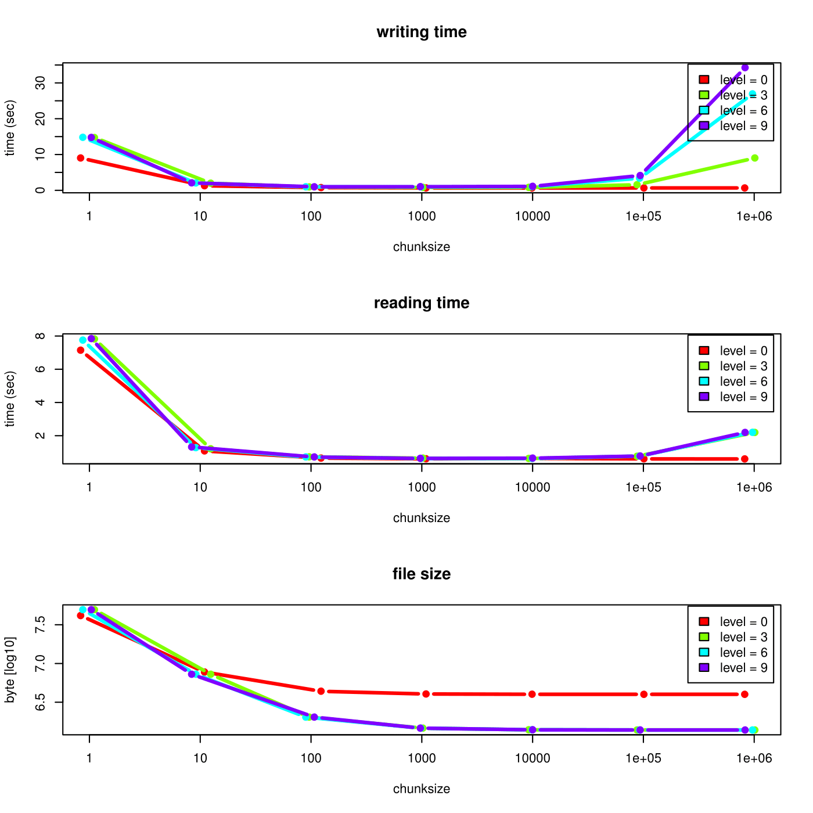

```{r cleanup, echo=FALSE, include=FALSE}
if(file.exists('myhdf5file.h5'))
    file.remove('myhdf5file.h5')
if(file.exists('newfile.h5'))
    file.remove('newfile.h5')
if(file.exists('newfile2.h5'))
    file.remove('newfile2.h5')
if(file.exists('newfile3.h5'))
    file.remove('newfile3.h5')
```

# Introduction
The package is an R interface for HDF5. On the one hand it implements
**R** interfaces to many of the low level functions from the C
interface. On the other hand it provides high level convenience
functions on **R** level to make a usage of HDF5 files more easy.

#Installation of the HDF5 package
To install the `r Biocpkg("rhdf5")` package, you need a current version
(>3.5.0) of **R** (www.r-project.org). After installing **R** you can
run the following commands from the **R** command shell to install `r Biocpkg("rhdf5")`.

```{r installation,eval=FALSE}
install.packages("BiocManager")
BiocManager::install("rhdf5")
```

# High level R-HDF5 functions

## Creating an HDF5 file and group hierarchy

An empty HDF5 file is created by
```{r createHDF5file}
library(rhdf5)
h5createFile("myhdf5file.h5")
```

The HDF5 file can contain a group hierarchy. We create a number of
groups and list the file content afterwards.
```{r create groups}
h5createGroup("myhdf5file.h5","foo")
h5createGroup("myhdf5file.h5","baa")
h5createGroup("myhdf5file.h5","foo/foobaa")
h5ls("myhdf5file.h5")
```

## Writing and reading objects

Objects can be written to the HDF5 file. Attributes attached to an
object are written as well, if `write.attributes=TRUE` is
given as argument to `h5write`. Note that not all
**R**-attributes can be written as HDF5 attributes.

```{r writeMatrix}
A = matrix(1:10,nr=5,nc=2)
h5write(A, "myhdf5file.h5","foo/A")
B = array(seq(0.1,2.0,by=0.1),dim=c(5,2,2))
attr(B, "scale") <- "liter"
h5write(B, "myhdf5file.h5","foo/B")
C = matrix(paste(LETTERS[1:10],LETTERS[11:20], collapse=""),
  nr=2,nc=5)
h5write(C, "myhdf5file.h5","foo/foobaa/C")
df = data.frame(1L:5L,seq(0,1,length.out=5),
  c("ab","cde","fghi","a","s"), stringsAsFactors=FALSE)
h5write(df, "myhdf5file.h5","df")
h5ls("myhdf5file.h5")
D = h5read("myhdf5file.h5","foo/A")
E = h5read("myhdf5file.h5","foo/B")
F = h5read("myhdf5file.h5","foo/foobaa/C")
G = h5read("myhdf5file.h5","df")
```

If a dataset with the given `name` does not yet exist, a
dataset is created in the HDF5 file and the object `obj` is
written to the HDF5 file. If a dataset with the given `name`
already exists and the datatype and the dimensions are the same as for
the object `obj`, the data in the file is overwritten. If the
dataset already exists and either the datatype or the dimensions are
different, `h5write()` fails.

## Writing and reading objects with file, group and dataset handles

File, group and dataset handles are a simpler way to read (and partially to write) HDF5 files.
A file is opened by `H5Fopen`.

```{r accessorH5Fopen}
h5f = H5Fopen("myhdf5file.h5")
h5f
```

The `$` and `&` operators can be used to access the next group level. While the `$` operator reads the object from disk, the `&` operator returns a group or dataset handle.

```{r accessorDF}
h5f$df
h5f&'df'
```

Both of the following code lines return the matrix `C`. Note however, that the first version reads the whole tree `/foo` in memory and then subsets to `/foobaa/C`, and the second version only reads the matrix `C`. The first `$` in `h5f$foo$foobaa$C` reads the dataset, the other `$` are accessors of a list. Remind that this can have severe consequences for large datasets and datastructures.

```{r accessorC1}
h5f$foo$foobaa$C
h5f$"/foo/foobaa/C"
```

One can as well return a dataset handle for a matrix and then read the matrix in chunks for out-of-memory computations. \warning{Please read the next section on subsetting, chunking and compression for more details}.

```{r accessorB1}
h5d = h5f&"/foo/B"
h5d[]
h5d[3,,]
```

The same works as well for writing to datasets. \warning{Remind that it is only guarenteed that the data is written on disk after a call to `H5Fflush` or after closing of the file.}
```{r accessorB2}
h5d[3,,] = 1:4
H5Fflush(h5f)
```

Remind again that in the following code the first version does not change the data on disk, but the second does.
```{r accessorB3,eval=FALSE}
h5f$foo$B = 101:120
h5f$"/foo/B" = 101:120
```

It is important to close all dataset, group, and file handles when not used anymore
```{r accessorClose1}
H5Dclose(h5d)
H5Fclose(h5f)
```
or close all open HDF5 handles in the environment by
```{r accessorClose2}
h5closeAll()
```

\subsection{Writing and reading with subsetting, chunking and compression}
The `r Biocpkg("rhdf5")` package provides two ways of subsetting. One can
specify the submatrix with the **R**-style index lists or with the HDF5
style hyperslabs. Note, that the two next examples below show two
alternative ways for reading and writing the exact same
submatrices. Before writing subsetting or hyperslabbing, the dataset
with full dimensions has to be created in the HDF5 file. This can be
achieved by writing once an array with full dimensions as in Section
\ref{sec_writeMatrix} or by creating a dataset. Afterwards the dataset
can be written sequentially.

\paragraph{Influence of chunk size and compression level} The chosen
chunk size and compression level have a strong impact on the reading
and writing time as well as on the resulting file size. In an example
an integer vector of size 10e7 is written to an HDF5 file. The file is
written in subvectors of size 10'000. The definition of the chunk size
influences the reading as well as the writing time. If the chunk size
is much smaller or much larger than actually used, the runtime
performance decreases dramatically. Furthermore the file size is
larger for smaller chunk sizes, because of an overhead. The
compression can be much more efficient when the chunk size is very
large. The following figure illustrates the runtime and file size
behaviour as a function of the chunk size for a small toy dataset.




After the creation of the dataset, the data can be written
sequentially to the HDF5 file. Subsetting in **R**-style needs the
specification of the argument index to `h5read()` and
`h5write()`.

```{r writeMatrixSubsetting}
h5createDataset("myhdf5file.h5", "foo/S", c(5,8),
                storage.mode = "integer", chunk=c(5,1), level=7)
h5write(matrix(1:5,nr=5,nc=1), file="myhdf5file.h5",
        name="foo/S", index=list(NULL,1))
h5read("myhdf5file.h5", "foo/S")
h5write(6:10, file="myhdf5file.h5",
        name="foo/S", index=list(1,2:6))
h5read("myhdf5file.h5", "foo/S")
h5write(matrix(11:40,nr=5,nc=6), file="myhdf5file.h5",
        name="foo/S", index=list(1:5,3:8))
h5read("myhdf5file.h5", "foo/S")
h5write(matrix(141:144,nr=2,nc=2), file="myhdf5file.h5",
        name="foo/S", index=list(3:4,1:2))
h5read("myhdf5file.h5", "foo/S")
h5write(matrix(151:154,nr=2,nc=2), file="myhdf5file.h5",
        name="foo/S", index=list(2:3,c(3,6)))
h5read("myhdf5file.h5", "foo/S")
h5read("myhdf5file.h5", "foo/S", index=list(2:3,2:3))
h5read("myhdf5file.h5", "foo/S", index=list(2:3,c(2,4)))
h5read("myhdf5file.h5", "foo/S", index=list(2:3,c(1,2,4,5)))
```

The HDF5 hyperslabs are defined by some of the arguments
`start`, `stride`, `count`, and
`block`. These arguments are not effective, if the argument
`index` is specified.

```{r writeMatrixHyperslab}
h5createDataset("myhdf5file.h5", "foo/H", c(5,8), storage.mode = "integer",
                chunk=c(5,1), level=7)
h5write(matrix(1:5,nr=5,nc=1), file="myhdf5file.h5", name="foo/H",
        start=c(1,1))
h5read("myhdf5file.h5", "foo/H")
h5write(6:10, file="myhdf5file.h5", name="foo/H",
        start=c(1,2), count=c(1,5))
h5read("myhdf5file.h5", "foo/H")
h5write(matrix(11:40,nr=5,nc=6), file="myhdf5file.h5", name="foo/H",
        start=c(1,3))
h5read("myhdf5file.h5", "foo/H")
h5write(matrix(141:144,nr=2,nc=2), file="myhdf5file.h5", name="foo/H",
        start=c(3,1))
h5read("myhdf5file.h5", "foo/H")
h5write(matrix(151:154,nr=2,nc=2), file="myhdf5file.h5", name="foo/H",
        start=c(2,3), stride=c(1,3))
h5read("myhdf5file.h5", "foo/H")
h5read("myhdf5file.h5", "foo/H",
       start=c(2,2), count=c(2,2))
h5read("myhdf5file.h5", "foo/H",
       start=c(2,2), stride=c(1,2),count=c(2,2))
h5read("myhdf5file.h5", "foo/H",
       start=c(2,1), stride=c(1,3),count=c(2,2), block=c(1,2))
```

## Saving multiple objects to an HDF5 file (h5save)

A number of objects can be written to the top level group of an HDF5
file with the function `h5save()` (as analogous to the base
**R** function `save()`).
```{r h5save}
A = 1:7;  B = 1:18; D = seq(0,1,by=0.1)
h5save(A, B, D, file="newfile2.h5")
h5dump("newfile2.h5")
```

## List the content of an HDF5 file

The function `h5ls()` provides some ways of viewing the content of an HDF5 file.

```{r h5ls}
h5ls("myhdf5file.h5")
h5ls("myhdf5file.h5", all=TRUE)
h5ls("myhdf5file.h5", recursive=2)
```

## Dump the content of an HDF5 file

The function `h5dump()` is similar to the function `h5ls()`. If
used with the argument `load=FALSE`, it produces the same result
as `h5ls()`, but with the group structure resolved as a hierarchy
of lists. If the default argument `load=TRUE` is used all
datasets from the HDF5 file are read.

```{r h5dump}
h5dump("myhdf5file.h5",load=FALSE)
D <- h5dump("myhdf5file.h5")
```

## Reading HDF5 files with external software

The content of the HDF5 file can be checked with the command line tool
**h5dump** (available on linux-like systems with the HDF5 tools
package installed) or with the graphical user interface **HDFView**
(http://www.hdfgroup.org/hdf-java-html/hdfview/) available for all
major platforms.

```{r h5dump2, eval=FALSE}
system2("h5dump", "myhdf5file.h5")
```
*Please note, that arrays appear as transposed matrices when opening it
with a C-program (**h5dump** or **HDFView**). This is due to the fact the
fastest changing dimension on C is the last one, but on R it is the
first one (as in Fortran).*

## Removing content from an HDF5 file

As well as adding content to an HDF5 file, it is possible to remove entries using the function `h5delete()`.  To demonstrate it's use, we'll first list the contents of a file and examine the size of the file in bytes.

```{r h5delete1}
h5ls("myhdf5file.h5", recursive=2)
file.size("myhdf5file.h5")
```

We then use `h5delete()` to remove the **df** dataset by providing the file name and the name of the dataset, e.g.

```{r h5delete2}
h5delete(file = "myhdf5file.h5", name = "df")
h5ls("myhdf5file.h5", recursive=2)
```

We can see that the **df** entry has now disappeared from the listing.  In most cases, if you have a heirachy within the file, `h5delete()`  will remove children of the deleted entry too.  In this example we remove **foo** and the datasets below it are deleted too.  Notice too that the size of the file as decreased.

```{r h5delete3}
h5delete(file = "myhdf5file.h5", name = "foo")
h5ls("myhdf5file.h5", recursive=2)
file.size("myhdf5file.h5")
```

*N.B. `h5delete()` does not explicitly traverse the tree to remove child nodes.  It only removes the named entry, and HDF5 will then remove child nodes if they are now orphaned.  Hence it won't delete child nodes if you have a more complex structure where a child node has multiple parents and only one of these is removed.*

# 64-bit integers

**R** does not support a native datatype for 64-bit integers. All integers in **R** are
32-bit integers. When reading 64-bit integers from a HDF5-file, you
may run into troubles. `r Biocpkg("rhdf5")` is able to deal with 64-bit integers, but
you still should pay attention.

As an example, we create an HDF5 file that contains 64-bit integers.

```{r bit64integer1}
x = h5createFile("newfile3.h5")

D = array(1L:30L,dim=c(3,5,2))
d = h5createDataset(file="newfile3.h5", dataset="D64", dims=c(3,5,2),H5type="H5T_NATIVE_INT64")
h5write(D,file="newfile3.h5",name="D64")
```

There are three different ways of reading 64-bit integers in
**R**. `H5Dread()` and `h5read()` have the argument
`bit64conversion` the specify the conversion method.

By setting `bit64conversion='int'`, a coercing to 32-bit
integers is enforced, with the risk of data loss, but with the
insurance that numbers are represented as native integers.

```{r bit64integer2}
D64a = h5read(file="newfile3.h5",name="D64",bit64conversion="int")
D64a
storage.mode(D64a)
```

`bit64conversion='double'` coerces the 64-bit integers to floating
point numbers. doubles can represent integers with up to 54-bits, but
they are not represented as integer values anymore. For larger numbers
there is still a data loss.

```{r bit64integer3}
D64b = h5read(file="newfile3.h5",name="D64",bit64conversion="double")
D64b
storage.mode(D64b)
```

`bit64conversion='bit64'` is the recommended way of coercing. It
represents the 64-bit integers as objects of class *integer64* as
defined in the package `r CRANpkg("bit64")`. Make sure that you have installed
`r CRANpkg("bit64")`.
*The datatype *integer64* is not part of base **R**, but defined
in an external package. This can produce unexpected behaviour when
working with the data.* When choosing this option the package `r CRANpkg("bit64")`
will be loaded.

```{r bit64integer4}
D64c = h5read(file="newfile3.h5",name="D64",bit64conversion="bit64")
D64c
class(D64c)
```

<!--
##Large integer data types

The following table gives an overview of the limits of the different integer representations in R and in HDF5.

\definecolor{Gray1}{gray}{0.85}
\definecolor{Gray2}{gray}{0.8}
\definecolor{Gray3}{gray}{0.75}
\definecolor{LightBlue}{rgb}{0.88,0.88,1}

\newcommand{\N}{-}
\newcommand{\Y}{\cellcolor{Gray2}+}

\begin{tabular}{|l|r||c|c|c||c|c|c|c|}
\hline
\rowcolor{LightBlue}
\multicolumn{2}{|c||}{value} &
\multicolumn{3}{c||}{R-datatype} &
\multicolumn{4}{c|}{HDF5 datatype}\\
\rowcolor{LightBlue}
\multicolumn{2}{|c||}{} &
integer & double & integer64 &
I32 & U32 & I64 & U64 \\
\hline
\hline
$\phantom{-}2^{64}$ & 18446744073709551616 &
\phantom{\vdots} - \phantom{\vdots}& - & - &
- & - & - & - \\
\hline
$\phantom{-}2^{64}-1$ & 18446744073709551615 &
\phantom{\vdots} - \phantom{\vdots}& - & - &
- & - & - & \Y \\\hline
$\phantom{-}$\vdots & \vdots &
\vdots & \vdots & \vdots &
\vdots & \vdots & \vdots & \cellcolor{Gray2}\vdots \\
\hline
$\phantom{-}2^{63}$ & 9223372036854775808 &
\phantom{\vdots} - \phantom{\vdots} & - & - &
- & - & - & \Y \\\hline
$\phantom{-}2^{63}-1$ & 9223372036854775807  &
\phantom{\vdots} - \phantom{\vdots} & - & \Y &
- & - & \Y & \Y \\\hline
$\phantom{-}$\vdots & \vdots &
\vdots & \vdots & \cellcolor{Gray2}\vdots &
\vdots & \vdots & \cellcolor{Gray2}\vdots & \cellcolor{Gray2}\vdots \\
\hline
$\phantom{-}2^{53}$ & 9007199254740992 &
\phantom{\vdots} - \phantom{\vdots} & - & \Y &
- & - & \Y & \Y \\\hline
$\phantom{-}2^{53}-1$ & 9007199254740991 &
\phantom{\vdots} - \phantom{\vdots} & \Y & \Y &
- & - & \Y & \Y \\\hline
$\phantom{-}$\vdots & \vdots &
\vdots & \cellcolor{Gray2}\vdots & \cellcolor{Gray2}\vdots &
\vdots & \vdots & \cellcolor{Gray2}\vdots & \cellcolor{Gray2}\vdots \\
\hline
$\phantom{-}2^{32}$ & 4294967296 &
\phantom{\vdots} - \phantom{\vdots} & \Y & \Y &
- & - & \Y & \Y \\\hline
$\phantom{-}2^{32}-1$ & 4294967295 &
\phantom{\vdots} - \phantom{\vdots} & \Y & \Y &
- & \Y & \Y & \Y \\\hline
$\phantom{-}$\vdots & \vdots &
\vdots & \cellcolor{Gray2}\vdots & \cellcolor{Gray2}\vdots &
\vdots & \cellcolor{Gray2}\vdots & \cellcolor{Gray2}\vdots & \cellcolor{Gray2}\vdots \\
\hline
$\phantom{-}2^{31}$ & 2147483648 &
\phantom{\vdots} - \phantom{\vdots} & \Y & \Y &
- & \Y & \Y & \Y \\\hline
$\phantom{-}2^{31}-1$ & 2147483647 &
\phantom{\vdots}\Y\phantom{\vdots} & \Y & \Y &
\Y & \Y & \Y & \Y \\\hline
$\phantom{-}$\vdots & \vdots &
\cellcolor{Gray2}\vdots & \cellcolor{Gray2}\vdots & \cellcolor{Gray2}\vdots &
\cellcolor{Gray2}\vdots & \cellcolor{Gray2}\vdots & \cellcolor{Gray2}\vdots & \cellcolor{Gray2}\vdots \\
\hline
$\phantom{-}2^0$ & 1 &
\phantom{\vdots}\Y\phantom{\vdots} & \Y & \Y &
\Y & \Y & \Y & \Y \\\hline
$\phantom{-}0$ & 0 &
\phantom{\vdots}\Y\phantom{\vdots} & \Y & \Y &
\Y & \Y & \Y & \Y \\\hline
$-2^0$ & -1 &
\phantom{\vdots}\Y\phantom{\vdots} & \Y & \Y &
\Y & - & \Y & - \\\hline
$\phantom{-}$\vdots & \vdots &
\cellcolor{Gray2}\vdots & \cellcolor{Gray2}\vdots & \cellcolor{Gray2}\vdots &
\cellcolor{Gray2}\vdots & \vdots & \cellcolor{Gray2}\vdots & \vdots \\
\hline
$-2^{31}+1$ & -2147483647 &
\phantom{\vdots}\Y\phantom{\vdots} & \Y & \Y &
\Y & - & \Y & - \\\hline
$-2^{31}$ & -2147483648 &
\cellcolor{Gray2}\phantom{\vdots}NA\phantom{\vdots} & \Y & \Y &
\Y & - & \Y & - \\\hline
$-2^{31}-1$ & -2147483649 &
\phantom{\vdots} - \phantom{\vdots} & \Y & \Y &
- & - & \Y & - \\\hline
$\phantom{-}$\vdots & \vdots &
\vdots & \cellcolor{Gray2}\vdots & \cellcolor{Gray2}\vdots &
\vdots & \vdots & \cellcolor{Gray2}\vdots & \vdots \\
\hline
$-2^{53}+1$ & -9007199254740991 &
\phantom{\vdots} - \phantom{\vdots} & \Y & \Y &
- & - & \Y & - \\\hline
$-2^{53}$ & -9007199254740992 &
\phantom{\vdots} - \phantom{\vdots} & - & \Y &
- & - & \Y & - \\\hline
$\phantom{-}$\vdots & \vdots &
\vdots & \vdots & \cellcolor{Gray2}\vdots &
\vdots & \vdots & \cellcolor{Gray2}\vdots & \vdots \\
\hline
$-2^{63}+1$ & -9223372036854775807 &
\phantom{\vdots} - \phantom{\vdots} & - & \Y &
- & - & \Y & - \\\hline
$-2^{63}$ & -9223372036854775808 &
\phantom{\vdots} - \phantom{\vdots} & - & \cellcolor{Gray2}NA &
- & - & \Y & - \\\hline
$-2^{63}-1$ & -9223372036854775809 &
\phantom{\vdots} - \phantom{\vdots} & - & - &
- & - & - & - \\\hline
\end{tabular}


From the table it becomes obvious that some integer values in HDF5
files cannot be displayed in R. Note that this can happen for both
64-bit integer as well as for unsigned 32-bit integer. When generating
an HDF5 file, it is recommended to use signed 32-bit integers.
-->

# Low level HDF5 functions
## Creating an HDF5 file and a group hierarchy

Create a file.
```{r createfile,quiet=FALSE}
library(rhdf5)
h5file = H5Fcreate("newfile.h5")
h5file
```

and a group hierarchy
```{r create_groups, quiet=FALSE}
h5group1 <- H5Gcreate(h5file, "foo")
h5group2 <- H5Gcreate(h5file, "baa")
h5group3 <- H5Gcreate(h5group1, "foobaa")
h5group3
```

## Writing data to an HDF5 file

Create 4 different simple and scalar data spaces. The data space sets the dimensions for the datasets.

```{r createdataspace, quiet=FALSE}
d = c(5,7)
h5space1 = H5Screate_simple(d,d)
h5space2 = H5Screate_simple(d,NULL)
h5space3 = H5Scopy(h5space1)
h5space4 = H5Screate("H5S_SCALAR")
h5space1
H5Sis_simple(h5space1)
```

Create two datasets, one with integer and one with floating point numbers.

```{r create_dataset}
h5dataset1 = H5Dcreate( h5file, "dataset1", "H5T_IEEE_F32LE", h5space1 )
h5dataset2 = H5Dcreate( h5group2, "dataset2", "H5T_STD_I32LE", h5space1 )
h5dataset1
```

Now lets write data to the datasets.
```{r writedata}
A = seq(0.1,3.5,length.out=5*7)
H5Dwrite(h5dataset1, A)
B = 1:35
H5Dwrite(h5dataset2, B)
```

To release resources and to ensure that the data is written on disk,
we have to close datasets, dataspaces, and the file. There are
different functions to close datasets, dataspaces, groups, and files.
```{r closefile}
H5Dclose(h5dataset1)
H5Dclose(h5dataset2)

H5Sclose(h5space1)
H5Sclose(h5space2)
H5Sclose(h5space3)
H5Sclose(h5space4)

H5Gclose(h5group1)
H5Gclose(h5group2)
H5Gclose(h5group3)

H5Fclose(h5file)
```

<!--
% We can now check how it looks like on disk.
% ```{r h5dump}
% system("h5dump newfile2.h5")
% ```
% Please note, that arrays appear as transposed matrices when opening it with a C-program (h5dump). This is due to the fact the fastest changing dimension on C is the last one, but on \R~ it is the first one (as in Fortran).
-->

# Session Info

```{r sessioninfo}
sessionInfo()
```

```{r cleanup_after, echo=FALSE, include=FALSE}
for(file in c('myhdf5file.h5', 'newfile.h5', 'newfile2.h5', 'newfile3.h5')) {
    if(file.exists(file)) {
        file.remove( file )
    }
}
```
